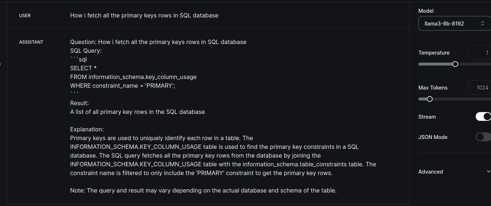

# SQL Query Agent 🤖📊

Welcome to the SQL Query Agent! This application allows you to interact with an SQLite database using plain English questions. Powered by GroqCloud, Llama3, and Langchain, it translates your questions into SQL queries, executes them, and presents the results in a user-friendly manner. Perfect for non-technical analysts to get insights from the database without needing SQL knowledge.

## Features ✨

- 🔍 **Natural Language Processing**: Converts plain English questions into SQL queries.
- ⚡ **Real-time Query Execution**: Executes SQL queries on the fly and retrieves data.
- 🧠 **ReAct Prompting**: Utilizes reasoning and acting logic for better query handling.
- 💬 **Plain English Results**: Presents the results of the queries in an easy-to-understand format.
- 🔒 **Environment Variables**: Securely manages API keys and sensitive information using `.env` files.

## Setup Instructions 🛠️

Follow these steps to set up and run the SQL Query Agent locally:

### 1. Clone the Repository 📂

```bash
git clone https://github.com/your-username/sql-query-agent.git
cd db-agent
```

### 2. Install Dependencies 📦

Ensure you have Python installed on your system. Then, install the required Python libraries:

```bash
pip install -r requirements.txt
```
- You can also create a virtual enviroment for a better experince.
### 3. Download the Database 📥

Download the Microsoft Northwind Sample Database with a `.db` extension from [here](https://github.com/jpwhite3/northwind-SQLite3):

```bash
# Download the Northwind SQLite database file (example command)
wget https://github.com/jpwhite3/northwind-SQLite3/raw/master/Northwind_large.sqlite

# Rename it to have a .db extension
mv Northwind_large.sqlite Northwind_large.db
```

### 4. Set Up Environment Variables 🔐

Create a `.env` file in the root directory and add your GroqCloud API key:

```plaintext
GROQCLOUD_API_KEY=your_groqcloud_api_key_here
```

### 5. Verify the Database ✅

You can verify the tables in your database using the SQLite shell:

```bash
sqlite3 Northwind_large.db
sqlite> .tables
```

### 6. Run the Application 🚀

Run the Python script to start the SQL Query Agent:

```bash
python agent.py
```

## Usage 📝

Type your questions in plain English, and the agent will convert them into SQL queries, execute them, and return the results. For example:

```plaintext
>> How many orders were placed in 1997?
Results:
[(830,)]
Explanation:
There were 830 orders placed in 1997.
```

Type `exit` or `quit` to end the session.
## Outputs

- Testing locally
## Additional Information ℹ️

This application leverages the power of GroqCloud, Llama3, and Langchain to provide a seamless and intelligent querying experience. By integrating ReAct prompting, it ensures accurate and meaningful interactions.

### Contributions 🤝

Contributions are welcome! Feel free to fork the repository and submit pull requests. For major changes, please open an issue first to discuss what you would like to change.

### License 📄

This project is licensed under the MIT License - see the [LICENSE](LICENSE) file for details.

---

Made with ❤️ by [Amitabh Kumar](https://github.com/nithamitabh)


